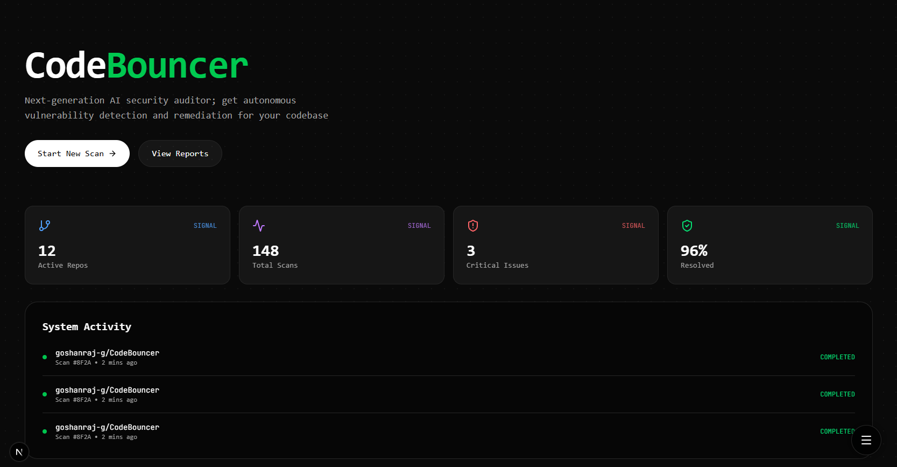
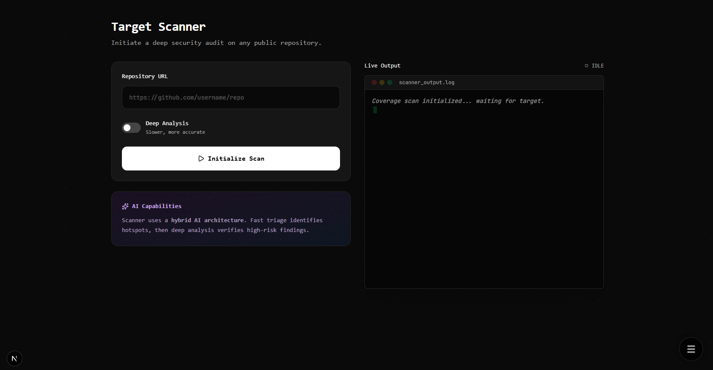
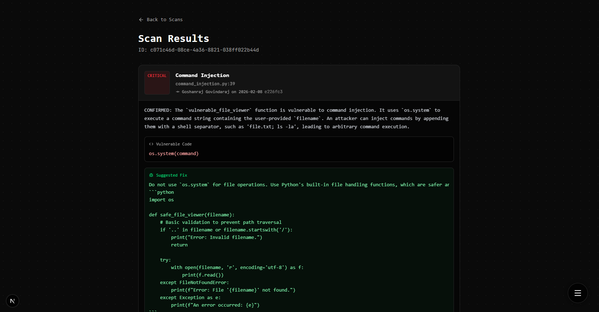

# 🛡️ CodeTurret
### **Turn your vibe-coded project ready for production**
**Winner of Google Developer Groups @ McMaster Hackathon 🏆**

CodeTurret is an automated security architect designed for the era of vibe-coding. Point it at any GitHub repository and it will scan for vulnerabilities, stream results live, and automatically open a pull request with AI-generated fixes.

---

## Key Features

- **Dual-Pass AI Scanning** — Gemini Flash for rapid triage across all files, Gemini Pro for deep analysis on high-severity findings
- **Real-Time Streaming** — scan progress streams file-by-file via Server-Sent Events; no waiting for a blocking response
- **Auto-Fix PRs** — after a scan, one click generates AI patches for every vulnerability and opens a GitHub Pull Request
- **Git Intelligence** — git blame, hot-file detection, and security commit analysis enrich every finding with authorship context
- **Ask Cortex** — natural-language security consultant powered by Snowflake Cortex AI; ask "who introduced the SQL injection?" and get an answer
- **Async Job Queue** — scans are processed via RabbitMQ workers; the API returns instantly and the UI streams progress

---

## Architecture

```
Next.js Frontend
      │
      ├── POST /api/scan  ─────────────────►  RabbitMQ [scan.requests]
      ├── GET  /api/scans/{id}/stream  ◄────  SSE ← RabbitMQ [scan.progress]
      ├── GET  /api/findings/{scanId}
      └── POST /api/ask  ──────────────────►  Snowflake Cortex AI

Spring Boot 3.3 (Java 21)
      ├── ScanWorker      — clones repo, runs Gemini Flash + Pro, persists findings
      └── FixWorker       — generates patches with Gemini Pro, pushes branch, opens PR

Storage
      ├── PostgreSQL      — repos, scans, findings, fix PRs
      └── Snowflake       — Cortex AI for natural-language Q&A over findings
```

---

## Tech Stack

| Layer | Technology |
|---|---|
| Backend | Java 21, Spring Boot 3.3 |
| Message Queue | RabbitMQ |
| Primary DB | PostgreSQL + Flyway |
| AI Scanning | Google Gemini 2.0 Flash + 2.5 Pro |
| AI Chat | Snowflake Cortex (`llama3.1-8b`) |
| Frontend | Next.js 14, Tailwind CSS |
| Git Operations | JGit |

---

## Getting Started

### Prerequisites
- Java 21
- Maven
- Docker Desktop (for PostgreSQL + RabbitMQ)
- A [Gemini API key](https://aistudio.google.com)
- Snowflake account (for the Ask feature — optional)

### Run locally

```bash
# 1. Start PostgreSQL + RabbitMQ
cd backend
docker-compose up -d

# 2. Configure environment
cp .env.example .env
# Fill in GEMINI_API_KEY, ENCRYPTION_SECRET_KEY
# Add SNOWFLAKE_* credentials if you want the Ask feature

# 3. Start the backend (Flyway auto-creates tables on first run)
mvn spring-boot:run

# 4. Start the frontend
cd ../frontend
cp .env.local.example .env.local
npm install && npm run dev
```

Backend: `http://localhost:8080` · Frontend: `http://localhost:3000`

---

## API

| Method | Endpoint | Description |
|---|---|---|
| `POST` | `/api/scan` | Queue a scan, returns `scanId` immediately |
| `GET` | `/api/scans/{id}/stream` | SSE stream of real-time scan progress |
| `GET` | `/api/scans` | List recent scans |
| `GET` | `/api/findings/{scanId}` | Get findings for a scan |
| `POST` | `/api/scans/{id}/fix` | Queue auto-fix PR generation |
| `GET` | `/api/scans/{id}/fix` | Get fix PR status |
| `POST` | `/api/ask` | Ask Cortex a question about a scan |
| `POST` | `/api/repos` | Register a repo with a GitHub PAT |

---

## Screenshots

| Homepage | Scanner | Reports |
|---|---|---|
|  |  |  |
